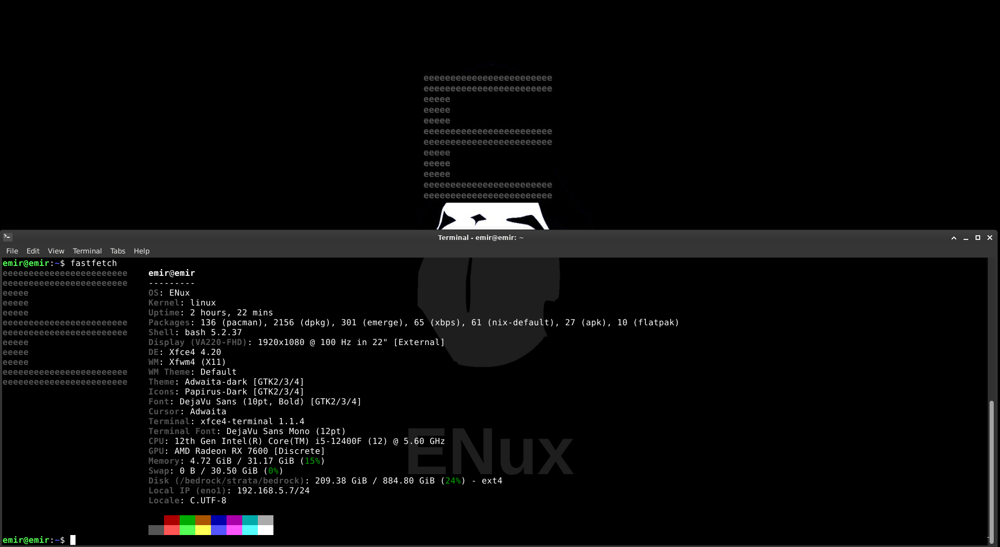
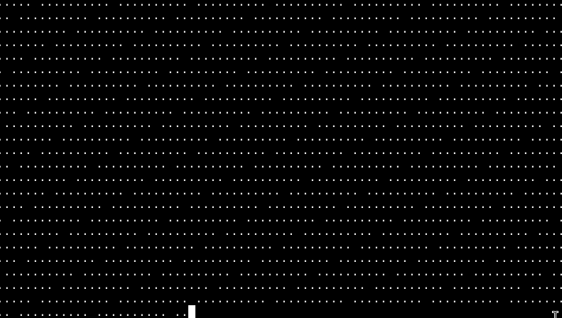

# ENux 5.6.3

Welcome to **ENux 5.6.3**, a Debian-based Linux distribution with **Bedrock Linux pre-installed**.

## What is ENux?

ENux 5.6.3 is a Debian-based distribution with Bedrock Linux on top, and is the first ever Linux distribution that has Bedrock Linux pre-installed.

This configuration allows you to use multiple mainstream Linux package managers on a single system:

- dpkg / apt (Debian)
- apk (Alpine)
- xbps (Void)
- dnf / rpm (Fedora / Red Hat)
- zypper (openSUSE)
- emerge / portrage (Gentoo)
- pacman (Arch)
- enux (ENux's pmm wrapper)
- epkg (EPkgOS) 
- nix (NixOS)
- flatpak
- epm (ENux) 

**Conflict resolution:**
Bedrock Linux handles most compatibility headaches. For beginners, **enux** simplifies package management into one easy-to-use tool.
Note: nix, epkg, epm and flatpak aren't a part of brl/pmm, they're independent

**About Nix**: ENux 5.6.3's installer will not install Nix because of the environment. You can still test it in the live environment.

---

## Features

- Debian base for stability and reliability  
- Bedrock Linux pre-installed
- Access to multiple package managers on one system  
- Unified **enux** tool for simplified package management
- A nice ENux Welcomer CLI program
- Lightweight **XFCE** desktop for performance  
- Clean, minimal, and beginner-friendly setup
- Our own Linux 7.1.0-rc4-enux kernel, ensuring you got the latest bleeding edge hardware and firmware support
- Created with our own ISO Creator tool

---

## Difference Between ENux Versions

### ENux Live
- Has Bedrock Linux pre-installed, and has support for using Bedrock Linux commands on the live environment
- Pretty minimal (~1.2 GB), has XFCE pre-installed
- Is recommended for intermediates who want a desktop environment on the live environment, and aren't scared of the terminal

### ENux Netinst
- Has Bedrock Linux pre-installed, but doesn't have support for using Bedrock Linux commands on the live environment
- There is no GUI, only CLI/TTY
- The installation requires you to have really stable networking
- Is recommended for people who doesn't want any GUI on their system, and prefer network installers

## Difference Between ENux 1.0, 2.0, 2.1, 3.0 and 4.0, 4.5, 5.0, 5.1.1, 5.2.1 5.3.1 5.3.2 5.3.3, 5.4.3, 5.5.3 and 5.6.3

### ENux 1.0
- Multi-step installation process  
- Required running Calamares, then **ENux Finaliser Phase 1**, then **Finaliser Phase 2**  
- Bedrock Linux installed after the base system  

### ENux 2.0
- Bedrock Linux is downloaded and installed directly during Calamares using `wget` and `--hijack`  
- Installation reduced to a single main step  
- Only one Finaliser is required to **brl fetch** the stratas  

### ENux 2.1
- ENux Finaliser now runs automatically as a **first-boot script**  
- Keeping the **.desktop shortcut** to manually access the Finaliser  
- Bug fixes and improvements to the Finaliser  
- Improved system branding and metadata  
- Overall installation flow is smoother and more polished

### ENux 3.0
 - Added support for CentOS 10-stream, giving you a more stable and long term dnf support
 - Added openSUSE Tumbleweed support, now you can use zypper too.
 - Removed Fedora, because ENux used to use Fedora 41 and it is almost EOL
 - The Finalizer isn't a hybrid first-boot script with a .desktop shortcut. It is returned to old fashioned .desktop shortcut installation.

### ENux 4.0
 - Added support for NixOS's nix package manager
 - Changed the live username from "enux" to "ENux", making the username look more polished
 - Changed the live hostname from "enux" to "ENux-Live-System", making the user feel more like in a live system
 - Now using Cinnamon's Lightdm, giving you a simpler, less flashy experience

### ENux 4.5
 - Switched from Debian's 6.12.57-deb13+amd64 kernel, to 6.18.5-enux kernel
 - The kernel experience will stay the same
 - The overall user experience got more polished

### ENux 5.0
 - Created an **ENux Welcomer** first boot CLI script, that installs recommended packages, tells you what ENux is, brl fetches + adds nix and let's you test a package manager (xbps)
 - Replaced **ENux Finalizer** with **ENux Welcomer**
 - Fixed some minor bugs from **Calamares**, **enuxfetch** and **config.jsonc** for **enuxfetch**
 - Using zstd compression instead of xz for faster boot speeds

### ENux 5.0.1
  - Introducing the ENux Package Manager, a nice tool that uses "pmm" as for the backend
  - Improved the visuals on the terminal 

### ENux 5.1.1
  - ENux 5.1.1 is the first ever Linux distribution that has Bedrock Linux pre-installed
  - This version was created with our own tools such as the ENux ISO Creator, that uses ENuxbootstrap, and other tools on the backend
  - ENux 5.1.1 also replaced Calamares, with our own installer, which is both avaible on CLI and TUI
  - The ISO size is only 1.04 GB, compared to 5 GB on ENux 5.0.1
  - ENux 5.1.1 now uses Linux kernel 7.0-rc2-enux-enux, ensuring you have the latest hardware and firmware support
  - We've switched from CentOS to Fedora, ensuring you have the latest and cutting-edge software support
  - Fixed minor bugs on the ENux Package Manager
  - Fixed minor bugs on branding 

### ENux 5.2.1 
   - Thank you all for 1000 downloads for Sourceforge. In honor to that, we've released ENux 5.2.1.
   - ENux 5.2.1 has easier networking with support for "plug and play" WiFi, and has Firefox pre-installed.
   - Switched from 7.0-rc2-enux-enux to 7.0-rc4-enux-enux kernel, for more hardware and firmware support.
   - Improved the ENux Installer and ENux Welcomer

### ENux 5.3.1 
   - Fixed a major bug on the ENux Installer.
   - Welcome Linux 7.0. To celebrate the release of Linux 7.0 Stable, ENux has switched from Linux kernel 7.0.0-rc4-enux-enux to 7.0.0-enux kernel

### ENux 5.3.2
   - Added EPkgOS's epkg
   - Improved the ENux Welcomer
   - Fixed a major bug for UEFI systems

   - Thank you everyone for the Rising Star award on Sourceforge. In honour to that, I'd like to introduce ENux Netinst. ENux Netinst is a lightweight non-GUI ISO with TUI installation support over the network with smaller ISO size and a more direct installation procces.

### ENux 5.3.3
   - With the community and myself's complain that the ENux installer doesn't do proper logging, and just exists if something bad happens, we've polished the ENux Installer (CLI and TUI). Now when something that does exit 1+ happens, the installer tells you what happens, and expects user input to exit. 
   - We've also made the ENux Welcomer TUI instead of CLI, for better looking asthetics, and overall user experience. 
   - ENux now uses the GPL-v3 license instead of no license.

### ENux 5.4.3

- Switched from 7.0.0-enux kernel to 7.1.0-rc4-enux
- ENux Live XFCE will now have Papirus Icon theme + Aidwata dark pre-configured
- ENux now has 15 package managers; added flatpak and [epm](https://github.com/ENux-Distro/epm)
- Added [E-Libc](https://github.com/ENux-Distro/epm)
- Added optional support for [init.c](https://github.com/ENux-Distro/init.c)
- Removed the ENux Installer CLI
- ENux now has [our dotfiles](https://github.com/ENux-Distro/dotfiles) pre-installed on both the live environment and the installed environment
- Added nix, epkg, epm and flatpak on the live environment
- Polished the ENux Installer and ENux Welcomer
- Created ENux Wiki
- Published a video on [how to install ENux Live XFCE](https://youtu.be/HXv2x1p0AKA?si=JwVNmMxdXRDIEPPh) (will create a video on how to install ENux Netinst as well)

### ENux 5.5.3

- ENux is the first ever Linux distribution with Bedrock Linux stratas pre-fetched
- ENux now has 15 package managers in the live environment, with 6 stratas pre-fetched in the live environment
- This allows you to test out the package managers, and Bedrock Linux commands without nuking your hard drive
- The ISO size has increased to ~3 GB but the experience got better
- Because of the ISO size, ENux 5.6.3 Live has replaced the GitHub pages mirror with Internet Archive's

### ENux 5.6.3

- Thank you everyone for 2000 downloads on SourceForge. To celebrate that milestone, I've released ENux 5.6.3 with Project ENux Simple, which is me trying to make ENux be a more beginner friendly distro (not Ubuntu/Mint/ZorinOS type of beginner friendly)
- Reduced installation process from 2 to 1
- Improved the TUI installer so its a Calamares style interrupted installed
- Added ENux Installer GUI, 
- Added ENux Package Manager GUI
- The installer won't install Nix because of the installer environment. You can still use it in the live environment.
- Removed the root and username ENux's password in the live environment
- 
## Historic Versions of ENux

### ENux Pre-Prototype 1.0
   - The goal was to make Arch Linux more beginner friendly with KDE Plasma, and ***Audio-Relay*** support with a nice README
   - The ISO image has never been created

### ENux Prototype 1.0
   - ENux's goal switched from beginner friendly Arch Linux to Debian with Bedrock Linux and 7 package managers
   - This version was my Debian system with Bedrock Linux and a few stratas.
   - The ISO image has never been created, but a showcase video exists on [here](https://www.youtube.com/watch?v=J61vbt4_iEY&t=9s)
   - **Warning:** Don't use the ENux Showcase video to learn more about ENux.

### ENux Beta 1.0
   - The first initial release of ENux
   - It was a tar archive containing 2 scripts
   - Technically the lightest version of ENux

## ENux Release Cycle

TL;DR: ENux uses a snapshot-based semi-rolling release model.

ENux is developed as a fast-moving system, where changes are continuously made and tested. When a set of changes is stable and meaningful, a new snapshot release is published (e.g. ENux 5.6.3).

ENux does not follow a fixed long-term release schedule. Instead, releases are made when major updates are ready, typically every 7–30+ days depending on development activity.

This approach allows ENux to stay fast-moving while still providing stable, installable snapshot ISOs for users.

## Hardware Requirements

**Minimum:**
- CPU: x86_64
- RAM: 550 MB  
- Storage: 25 GB  

**Recommended:**
- CPU: Dual-core  
- RAM: 800 MB  
- Storage: 35 GB  

**High-end:**
- CPU: Quad-core  
- RAM: 1 GB  
- Storage: 45+ GB  

---
## Installation Guide for ENux Live

1. Download ENux Live from
   - [ENux-5.6.3.iso](http://www.emirpasha.com/ENux-5.6.3.iso)
   - [ENux-5.6.3.iso (Sourceforge)](https://sourceforge.net/projects/enux/files/ENux-5.6.3/ENux-5.6.3.iso/download)
   - [ENux-5.6.3.iso (GitHub)](https://archive.org/download/enux-5.6.3/ENux-5.6.3.iso)

2. Flash the ISO to a USB drive using tools such as **Rufus** or **Balena Etcher**.

3. Boot from the USB drive and run the **ENux Installer (TUI)**.

4. After installation and reboot, and the **ENux Welcomer** will welcome you

## Installation Guide for ENux Netinst

1. Download ENux Netinst from
   - [ENux-Netinst-5.6.3.iso](http://www.emirpasha.com/ENux-Netinst-5.6.3.iso)
   - [ENux-Netinst-5.6.3.iso (Sourceforge)](https://sourceforge.net/projects/enux/files/ENux-5.6.3/ENux-Netinst-5.6.3.iso/download)
   - [ENux-Netinst-5.6.3.iso (GitHub)](https://github.com/ENux-Distro/ENux/releases/download/ENux-5.6.3/ENux-Netinst-5.6.3.iso)

2. Flash the ISO to a USB drive using tools such as **Rufus** or **Balena Etcher**.

3. Boot from the USB drive and select **Install ENux** on the bootloader

4. After installation and reboot, and the **ENux Welcomer** will welcome you

## Known Issues

### ENux Welcomer Mirroring

During the ENux Welcomer, Bedrock Linux strata(s) are fetched from external mirrors.

In rare cases, strata fetching may fail due to:
- Temporary mirror outages
- Slow or unstable internet connections
- Regional mirror availability issues

If this happens, you can try **brl fetch**ing the **strata** again with different mirrors
No system reinstallation is required.

Once the strata are fetched successfully, ENux is fully ready to use.

### LightDM Not Appearing After Installation

In rare cases of ENux Installation, LightDM couldn't be fully setup.
Therefore after installation, you may be on the TTY terminal.

In order to get to **XFCE**, you must run
 - **startx**

after you log in

### WiFi Not Working Out of the Box

When you first boot into ENux, you'll see that there is no WiFi on ENux. 
In order to get WiFi, do these steps:

- You need internet to do the steps below, so temporarily stream your phone's internet via USB tethering.
Don't worry, with USB tethering you can stream your phone's WiFi.
- Then, we need to see if the kernel see's your WiFi card. Open up the terminal and type `lspci -nnk | grep -iA 3 net`
If it says "Kernel driver in use", your hardware is recognized, but the network service isn't running.
If it says "Kernel modules" but no "driver in use", you are missing the firmware.
- First, install the firmware by running `sudo apt install linux-firmware firmware-linux-nonfree firmware-[output of lsspci -nnk | grep -iA 3 net (for example iwlwifi)]
Warning, you may need to add `non-free` and `non-free-firmware` to your `/etc/apt/sources.list`
- After installing the firmwares, enable Network Manager by running `sudo systemctl enable --now NetworkManager`
- We recommend you also run `sudo modprobe -r [output of lsspci -nnk | grep -iA 3 net (for example iwlwifi)] && sudo modprobe [output of lsspci -nnk | grep -iA 3 net (for example iwlwifi)]` to load the kernel modules
- Once that's all done, run `ip a`, if you see `wlan(...)` then your WiFi is initiliazed
- To connect to your WiFi Network, run `nmtui` and go to `Activate a Connection`. Select your WiFi router, and enter its password.
- After connecting to the network, sanity check if its running or not by running `ping emirpasha.com`. If you see something like:

PING www.emirpasha.com (2606:4700:3033::6815:50c3) 56 data bytes

64 bytes from 2606:4700:3033::6815:50c3: icmp_seq=1 ttl=59 time=4.27 ms

it means your WiFi is working.

### Lots of dots Gentoo brl fetch operation on the ENux Welcomer

If you see 

When the ENux Welcomer brl fetches Gentoo, then its nothing to panic or freak out. This means that the ENux Welcomer is downloading Gentoo stuff properly. Everything is working. (Also you can tell your friends you're hacking when this appears :D )

## Dev Notes

- The username on the live system is `ENux`
- The password on the live system is `enux`

- You can watch the ENux installation video from [here](https://www.youtube.com/watch?v=HXv2x1p0AKA)
## Troubleshooting

If you encounter issues:
- Visit [r/ENux on Reddit](https://www.reddit.com/r/ENux/)  
- Ask questions, report bugs, or share feedback with the community

